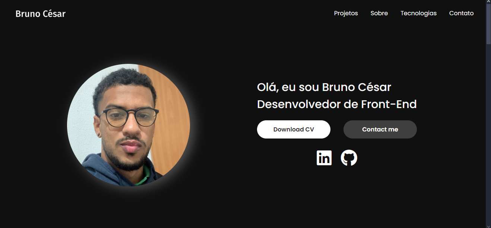

<h1 align="center">
  💻 Portfólio - Bruno César
</h1>

<h4 align="center"><a href="https://www.iuricode.com/">Clique para visitar o projeto</a></h4>

## 📚 Seções

O site é composto por quatro seções:

- **Projetos:** Apresenta alguns projetos desenvolvidos e com link direto para os respectivos códigos no GitHub;
- **Quem sou:** Nessa seção tenho uma descrição dizendo um pouco sobre quem sou;
- **Conhecimentos:** Nele apresentamos meus conhecimentos em algumas linguagens como o foco no front-end;
- **Contato:** Um pequeno formulário para que possa entrar em contato comigo;

---

## 💼 Tecnologias utilizadas

Para o desenvolvimento deste site utilizei as seguintes tecnologias:

- HTML;
- CSS;
- JavaScript;

---

Feito pro Bruno César Rocha da Silva 🖖🏽